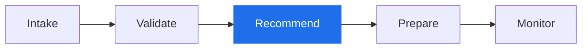
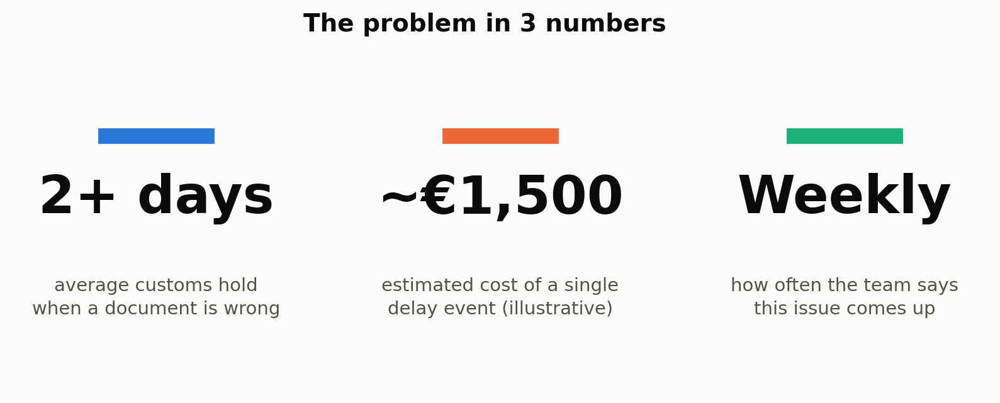
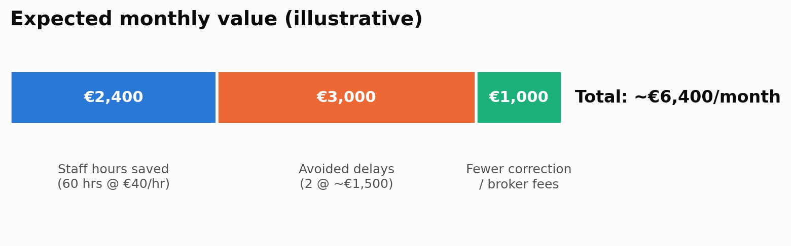
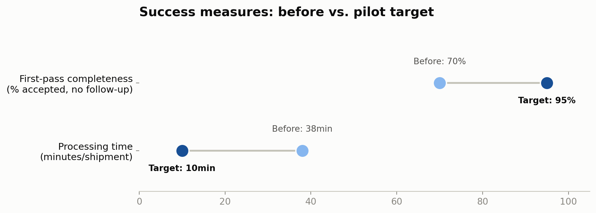
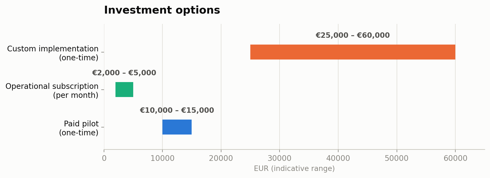
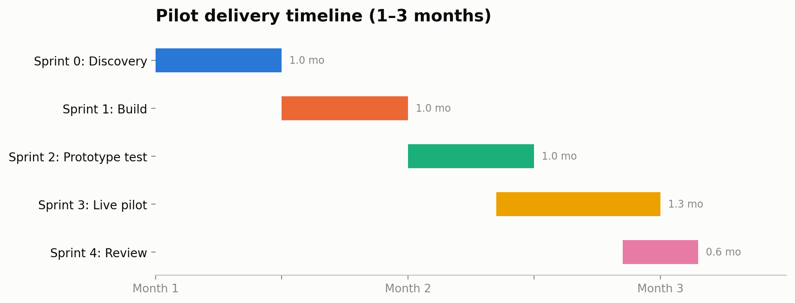

# ⚓ KlarSchiff: AI Pre-Shipment Document Check & HS Code Suggestion

**AI Consulting Capstone · Ironhack AI Consulting & Integration Bootcamp**
**Author:** Janaina Hoffmann · **Round:** 1 of 2 (pitch + proof of concept) · **Status:** Round 1 complete, presentation on 24 Sep 2026

> **Why "KlarSchiff"?** In German, *"Klar Schiff"* means the ship is ready and everything is in order. *Klar* also means **clear**: every suggestion the AI makes has to be clear enough for a human to check it in seconds. That is the direct answer to the client's biggest fear: *"AI is not transparent."*

---

## 1. The problem in one paragraph

**I&E LLC** is a mid-sized import/export SME in the **construction materials** sector. Its shipment documents (invoice, packing list, product data) are checked by hand, one person at a time. Wrong HS codes and missing documents (for example, a missing *Declaration of Performance* for CE-marked products) are usually discovered only when the shipment is already on the move, and then the fix is a **customs hold**, not a quick edit.

## 2. The proposed solution

KlarSchiff is a **human-supervised AI assistant** that checks shipment documents **before** a shipment leaves:



**Blue = what the Round 1 POC already runs.** At every step, a person approves before anything moves on. The AI **suggests**; it never decides and never files anything with customs.

## 3. Round 1 at a glance

| Deliverable | Where | Highlights |
|---|---|---|
| Sector research | [`research/sector_research.md`](research/sector_research.md) | Dated sources (EU ViDA, EU CPR 2024/3110) |
| Opportunities & risks | [`research/opportunities_risks.md`](research/opportunities_risks.md) | 5 opportunities + 7-risk register |
| Use cases | [`research/use_cases.md`](research/use_cases.md) | 1 primary use case + 2 alternatives ruled out, with reasons |
| Charts (5) | [`charts/`](charts/) · [docs](charts/charts_documentation.md) | Reproducible with `build_charts.py` |
| n8n POC | [`n8n/workflow.json`](n8n/workflow.json) · [docs](n8n/workflow_documentation.md) | 3 real nodes: Manual Trigger → Set → GPT-4o-mini |
| Eval plan | [`evaluation/eval_plan.md`](evaluation/eval_plan.md) | 5 criteria · 5 real cases · **3 Pass / 2 Partial / 0 Fail** |
| Cost & timeline | [`cost_estimation/`](cost_estimation/) | Explicit assumptions table |
| Round 1 decision | [`feedback/`](feedback/) | Added after the presentation (KEEP / CHANGE) |

### Charts preview

| | |
|---|---|
|  |  |
|  |  |
|  | |

## 4. Repository structure

```
.
├── README.md
├── requirements.txt
├── .env.example                 # variable names only, never real keys
├── research/
│   ├── sector_research.md
│   ├── opportunities_risks.md
│   └── use_cases.md
├── charts/
│   ├── 01…05_*.png
│   ├── build_charts.py
│   └── charts_documentation.md
├── n8n/
│   ├── workflow.json            # real export of the POC
│   └── workflow_documentation.md
├── evaluation/
│   └── eval_plan.md
├── cost_estimation/
│   ├── cost_analysis.md
│   └── timeline_estimate.md
└── feedback/                    # round1_decision.md after 24 Sep
```

## 5. How to run

**Charts**
```bash
pip install -r requirements.txt
python charts/build_charts.py
```

**POC:** import `n8n/workflow.json` into n8n, connect your own OpenAI credential, paste a case from the eval plan into the *Edit Fields* node and click *Execute workflow*. Full steps in [`n8n/workflow_documentation.md`](n8n/workflow_documentation.md#6-how-to-reproduce).

## 6. Honesty notes

- Some figures (delay cost, ROI, frequency) are **illustrative**. They come from a client-interview exercise, not from an external published study, and are marked as such in each file.
- All test cases are **synthetic**. No real client or personal data is used.
- The POC answers from the model's general knowledge. There is no tariff database yet, so fine-grained HS sub-codes can be imprecise (see eval case 5).

## 7. What comes next (Round 2)

Working MVP · LangSmith evaluation (dataset + traces + experiment) · ROI & risk assessment · EU AI Act and GDPR documentation · strategic deployment plan with a pilot phase.
