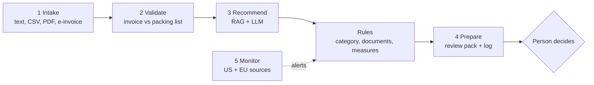

# ⚓ KlarSchiff: AI pre-shipment co-pilot

**HS code suggestion · document check · tariff monitor · master list, for any goods imported or exported (pilot: construction materials)**
AI Consulting Capstone · Ironhack AI Consulting & Integration Bootcamp · **Author:** Janaina Hoffmann (Berlin)
**Status:** Round 1 presented 24 Sep 2026 · **Round 2 (final) 10 Oct 2026**

> **Why "KlarSchiff"?** In German, *"Klar Schiff"* means the ship is ready and everything is in order. *Klar* also means **clear**: every suggestion must be clear enough for a person to check it in seconds. That answers the client's biggest fear: *"AI is not transparent."*
>
> 🌱 **Origin:** born in **Project 4 · SilverTrust**, a pair consulting exercise with my classmate Asal (logistics client) → [`00_origin_silvertrust/`](00_origin_silvertrust/)
> 🧭 [Module 1](https://github.com/ninagfcosta/ironhack-module-1_ai-foundations_podcast-studio) → [Module 2](https://github.com/ninagfcosta/ironhack-module-2_python-apis_content-creator) → [Module 3](https://github.com/ninagfcosta/ironhack-module-3_rag-agents_company-research) → [Module 4 · SilverTrust](https://github.com/ninagfcosta/ironhack-module-4_evaluation-compliance_silvertrust) → **Capstone · KlarSchiff**

---

## 0. Project journey: all phases at a glance

| # | Phase | When | What happened | Where to look |
|---|---|---|---|---|
| 0 | **Origin** | Sep 2026 (Module 4) | SilverTrust pair exercise with Asal: logistics client interview, first idea | [`00_origin_silvertrust/`](00_origin_silvertrust/) |
| 1 | **Round 1: research + POC** | 22-24 Sep | Sector research, use cases, charts, n8n POC (3 nodes), eval plan (5 cases), cost and timeline; presented 24 Sep | [`research/`](research/) · [`charts/`](charts/) · [`n8n/`](n8n/) · [`evaluation/eval_plan.md`](evaluation/eval_plan.md) · [`cost_estimation/`](cost_estimation/) |
| 2 | **Feedback → decision** | 24 Sep - 1 Oct | Teacher and classmates' feedback; KEEP the use case, 5 changes | [`feedback/round1_decision.md`](feedback/round1_decision.md) |
| 3 | **Round 2: build + evaluate (v2.0-v2.1)** | 24 Sep | Agent, MVP, n8n batch POC v2, 20-case LangSmith experiment, error analysis | [`klarschiff/`](klarschiff/) · [`mvp/`](mvp/) · [`poc/`](poc/) · [`evaluation/langsmith.md`](evaluation/langsmith.md) |
| 4 | **Pilot readiness (v2.2-v2.3)** | 25-29 Sep | Scans and photos, translation, EN/DE interface, any product (HS 2022), master list, prompt-injection guard; project kept fully fictional and within the course | [`PILOT_READINESS.md`](PILOT_READINESS.md) |
| 5 | **Pilot features (v2.4-v2.6)** | 4-6 Oct | Review queue, supplier e-mail draft, learning loop, e-mail inbox, Ask KlarSchiff assistant; errors E11-E12 found and fixed | [`mvp/`](mvp/) · [`klarschiff/`](klarschiff/) |
| 6 | **Business + compliance** | Sep - Oct | ROI and risks, EU AI Act, GDPR, strategic plan, consulting pack | [`roi_risk_assessment.md`](roi_risk_assessment.md) · [`compliance/`](compliance/) · [`strategic_plan.md`](strategic_plan.md) · [`consulting/`](consulting/) |
| 7 | **Final presentation** | 10 Oct 2026 | Slide deck + live demo | [`presentation.pdf`](presentation.pdf) |
| ➡️ | **Next: pilot → production** | after Oct 2026 | 3-month pilot with go / no-go criteria, about 12 months to full production | [`strategic_plan.md`](strategic_plan.md) |

The plan inside the project follows the same logic: **POC → Pilot → Full deployment**.

---

## 1. The problem

**I&E LLC** (fictional SME, construction materials) checks shipment documents by hand. Errors are **created when documents are prepared** but **found only at customs**, when the goods are already at the border: holds of 2+ days, ~€1,500 per delay, weekly (illustrative, SilverTrust interview, Sept 2026).

And the rules keep moving: EU **CBAM** since 1 Jan 2026, a new **EU steel measure** (50% out-of-quota duty) since 1 Jul 2026, US tariffs changed several times in 2025-2026 (IEEPA tariffs ended by the Supreme Court on 20 Feb 2026, Section 232 recalculated from 6 Apr 2026).

## 2. The solution

A **human-supervised agent** that checks a shipment before it leaves:


```mermaid
flowchart LR
    A[1 Intake<br/>text, CSV, PDF, e-invoice] --> B[2 Validate<br/>invoice vs packing list]
    B --> C[3 Recommend<br/>RAG + LLM]
    C --> R[Rules<br/>category, documents, measures]
    R --> D[4 Prepare<br/>review pack + log]
    M[5 Monitor<br/>US + EU sources] -. alerts .-> R
    D --> H{Person decides}
```

**The AI suggests; a person decides. Nothing is ever filed automatically.**

> **v2.2:** scans and photos, Turkish/Chinese invoices, EU model provider option, login + EU server setup, blind-test runner, **English / German interface switch** → [`PILOT_READINESS.md`](PILOT_READINESS.md)
>
> **v2.3: any product, not only construction.**
> - **Full HS 2022** (5,613 subheadings, public-domain UN reference texts) as the search base; the 50 broker-reviewed headings stay on top. Codes not yet reviewed always go to a person.
> - **Rule packs for all goods:** CE (machinery, electrical/radio + WEEE, batteries), export control (EU dual-use on export, US EAR for US-origin items), food/plants (official controls), EUDR (shown as *upcoming* until 30 Dec 2026), CBAM full scope, trade defence.
> - **Master list (Produktstamm):** part numbers change, the product stays. A new part number with the same description reuses the approved HS code and German description; similar products show the differences; conflicts in the client's list are found on import → [`klarschiff/master_list.py`](klarschiff/master_list.py)
> - **17 new test cases** from other industries: `python evaluation/run_eval.py --local --dataset universal`
> - **Security:** prompt-injection guard (hidden instructions in documents are flagged and ignored) → [`klarschiff/guard.py`](klarschiff/guard.py)
> - **Full codes:** 8-digit CN 2026 (EU) and US HTS lines from free official data (`python scripts/download_official_data.py`), rulings library (EBTI / CROSS) as evidence
> - **Scale:** batch check of many shipments in the app (tab 📦 Batch) or `python -m klarschiff.batch file.csv`, with token cost per line
> - **Consulting deliverables:** [`consulting/one_pager.md`](consulting/one_pager.md) · [`consulting/pilot_proposal.md`](consulting/pilot_proposal.md) · [`consulting/roadmap_to_production.md`](consulting/roadmap_to_production.md)

## 3. Try it (5 minutes)

```bash
python3 -m venv .venv && source .venv/bin/activate
pip install -r requirements.txt
cp .env.example .env            # add your own OPENAI_API_KEY and LANGSMITH_API_KEY (never commit .env)
streamlit run mvp/app.py        # the MVP (works offline too, in keyword mode)
python evaluation/run_eval.py --langsmith   # 20-case LangSmith experiment
python -m klarschiff.monitor    # tariff monitor (also runs daily via GitHub Actions)
```

## 4. Deliverables

### Round 2 (final)

| Deliverable | File | Highlights |
|---|---|---|
| Round 1 decision | [`feedback/round1_decision.md`](feedback/round1_decision.md) | KEEP the use case, 5 changes, 2 wrong Round 1 answer keys admitted |
| Use case definition | [`use_case_definition.md`](use_case_definition.md) | 3 categories with legal basis, e-invoicing, metrics, out of scope, R1 → R2 evolution |
| POC | [`poc/`](poc/) | n8n batch POC v2 (20 cases, prompt-only baseline) + agent architecture |
| **MVP** | [`mvp/`](mvp/) · [`klarschiff/`](klarschiff/) | Streamlit app (EN/DE), 5-step agent, RAG over the full HS 2022 + 50 reviewed headings, master list, versioned rules, tariff monitor, audit log |
| **LangSmith evaluation** | [`evaluation/langsmith.md`](evaluation/langsmith.md) | 20 cases, 6 evaluators, **error analysis (8 errors found, incl. a real LLM false all-clear)** |
| ROI & risks | [`roi_risk_assessment.md`](roi_risk_assessment.md) | 3 scenarios, break-even month 7 (base), 12 risks |
| EU AI Act | [`compliance/eu_ai_act_compliance.md`](compliance/eu_ai_act_compliance.md) | Minimal risk, reasoning step by step, Digital Omnibus 2026 dates |
| GDPR | [`compliance/gdpr_documentation.md`](compliance/gdpr_documentation.md) | Data flow, legal bases, DPIA screening, transfers, retention |
| Strategic plan | [`strategic_plan.md`](strategic_plan.md) | Pilot with go/no-go criteria, German go-to-market via customs brokers, pricing |
| Consulting pack | [`consulting/`](consulting/) | One-pager, pilot proposal, roadmap to production |
| **Presentation** | [`presentation.pdf`](presentation.pdf) | Final deck (business, compliance, technical, errors found) |
| Demo video | `poc/KlarSchiff_demo.mp4` | 2-5 min end-to-end recording of the MVP (script: [`mvp/mvp_documentation.md`](mvp/mvp_documentation.md) §6), also shown live on 10 Oct |

### Round 1

| Deliverable | File |
|---|---|
| Sector research, opportunities & risks, use cases | [`research/`](research/) |
| Charts (5 + ROI scenarios) | [`charts/`](charts/) |
| n8n POC (3 nodes) | [`n8n/`](n8n/) |
| Eval plan (5 cases) | [`evaluation/eval_plan.md`](evaluation/eval_plan.md) |
| Cost & timeline | [`cost_estimation/`](cost_estimation/) |

## 5. Repository structure

```
.
├── klarschiff/            # the agent: intake, validate, retrieval, recommend, rules, monitor, report
│   └── knowledge/         # hs2022_subheadings.json (5,613), hs_headings.json (50 reviewed), trade_measures.json (rule packs + sources)
├── mvp/                   # Streamlit app + sample data + documentation
├── evaluation/            # dataset (20 cases), evaluators, runner, LangSmith doc, results
├── poc/                   # n8n batch POC v2 + demo video
├── compliance/            # EU AI Act, GDPR
├── consulting/            # one-pager, pilot proposal, roadmap to production
├── scripts/               # free download of official tariff data (CN 2026, US HTS)
├── data/                  # decision log, monitor state, alerts (created at runtime)
├── .github/workflows/     # daily tariff monitor
├── research/ charts/ n8n/ cost_estimation/ feedback/ 00_origin_silvertrust/
├── use_case_definition.md · roi_risk_assessment.md · strategic_plan.md
└── presentation.pdf · PILOT_READINESS.md
```

## 6. Honesty notes

- Money figures are **illustrative** (client-interview exercise); the pilot replaces them with measured values.
- All test shipments are **synthetic**; no real client or personal data.
- Any product can be classified (full HS 2022), but only **50 reviewed headings** and **master-list products** are trusted without extra review; all rules must be re-verified by a licensed customs professional. Duty rates are **linked live** (TARIC, EZT-online, HTS), not stored.
- The same author wrote the tests and the knowledge base, so scores are **likely optimistic**; the pilot includes a blind test labelled by the broker.
- **Change rule:** re-run `evaluation/run_eval.py` before changing the model, the prompt or the rules.
