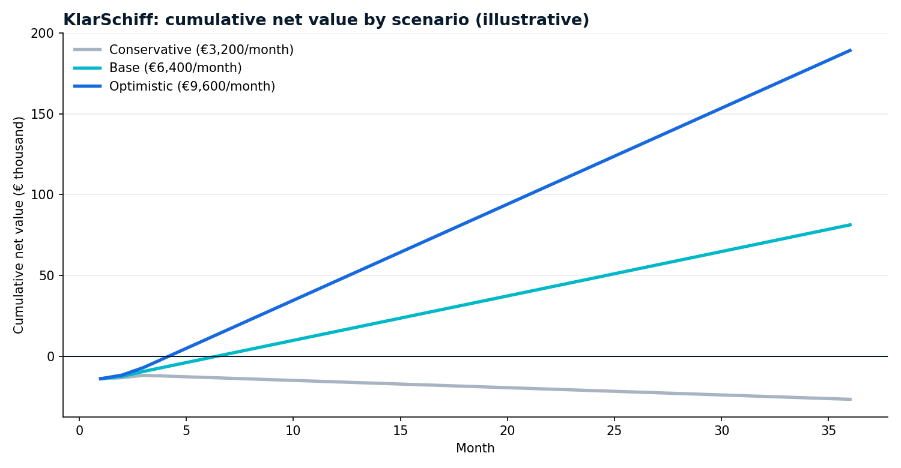

# ROI and risk assessment

**Version:** Round 2 · 25 September 2026 · model: `charts/build_roi.py` → `charts/06_roi_scenarios.png`, `charts/roi_results.json`

> All value figures are **illustrative** (SilverTrust client-interview exercise, Sept 2026, and own estimates in `cost_estimation/cost_analysis.md`). The pilot's first job is to replace them with I&E's measured baseline.

## 1. Costs

| Cost item | Amount | Type | Basis |
|---|---|---|---|
| Paid pilot (3 months, 1 route, 1 product family) | €12,500 (range €10-15k) | one-off, month 1 | `cost_analysis.md` |
| AI-literacy training + change management | €1,300 | one-off | 2 people × 16 h × €40; required anyway by AI Act Art. 4 |
| Subscription after the pilot (rule updates, monitor, support) | €3,500 / month (range €2-5k) | recurring, from month 4 | `cost_analysis.md` |
| Technology | €150 / month | recurring | hosting ~€30, LangSmith Plus 1 seat $39, LLM tokens, backups |
| LLM tokens alone | < €5 / month | recurring | ~2,000 tokens per check × 1,000 checks at $0.15 / $0.60 per 1M tokens (GPT-4o-mini) |

The LLM is **not** the cost driver; people and rule maintenance are.

## 2. Value (monthly, when fully running)

| Value driver | Base | Calculation |
|---|---|---|
| Staff time saved | €2,400 | 60 h/month × €40 (review time 30-45 min → < 10 min) |
| Customs delays avoided | €3,000 | 2 delays/month × ~€1,500 |
| Fewer corrections and broker fees | €1,000 | estimate |
| **Total (base)** | **€6,400** | |

Not included (upside, not counted): lower penalty and audit risk, faster onboarding of new staff, readiness for e-invoicing (DE 2027/2028) and CBAM reporting.

During the pilot, value ramps up: 0% in month 1, 25% in month 2, 50% in month 3.

## 3. ROI, break-even and scenarios

| Scenario | Monthly value | Break-even | ROI after 12 months | ROI after 36 months |
|---|---|---|---|---|
| Conservative | €3,200 | **not reached** at €3,500 subscription | -34% | -20% |
| **Base** | **€6,400** | **month 7** | **+32%** (cost €47.1k, value €62.4k) | **+60%** (cost €134.7k, value €216.0k) |
| Optimistic | €9,600 | month 5 | +99% | +141% |

**What changed from Round 1:** Round 1 said "payback ≈ 1.6 months", comparing the pilot fee with the monthly value. Round 2 adds the subscription, the technology cost and the ramp-up, and gets **month 7 (base)**. The more honest number is the better sales argument.

**What the conservative case teaches:** if the real value is only half, a €3,500 subscription never pays back. So the subscription is **tied to volume**: the €2,000 tier brings the conservative case to break-even in month 15 (+27% after 36 months). The pilot measures the value first, and the price follows.

### Assumptions to validate in the pilot

| Assumption | How the pilot measures it |
|---|---|
| 30-45 min review today | Time 20 shipments before go-live (Sprint 0) |
| Weekly holds caused by documentation | 12 months of broker correction history |
| €1,500 per delay | Storage, demurrage, penalties and staff time from real incidents |
| €40/hour | I&E's loaded labour cost |
| Unnecessary review rate < 30% | Decision log |

## 4. Risk register

Score = likelihood (1-5) × impact (1-5). ≥ 12 high, 8-11 medium, < 8 low.

| # | Risk | Category | L | I | Score | Mitigation | Owner |
|---|---|---|---|---|---|---|---|
| R1 | **Wrong HS code accepted** (misclassification → wrong duty, penalties) | Technical / legal | 3 | 5 | **15** | RAG over a reviewed knowledge base; person approves every code; confidence threshold; Binding Tariff Information (vZTA) for recurring products | Broker + logistics lead |
| R2 | **Tariff or rule changes not noticed** (US 2025-26 changes, EU steel measure, CBAM) | Regulatory | 4 | 4 | **16** | Monitor step (daily), alerts force review, `last_verified` + re-check interval per rule, links to live TARIC/HTS | Consultant (subscription) |
| R3 | **Automation bias**: people approve without checking | Ethical / operational | 3 | 4 | **12** | Reasons and sources always visible; team-level override rate; monthly spot audit of 10 approved codes | Logistics lead |
| R4 | **Liability for customs errors**: the declarant is liable, not the AI; claims against the consultant | Legal | 2 | 5 | **10** | Contract: decision support only, limitation of liability; professional indemnity insurance (*Berufshaftpflicht*); disclaimer on every pack | Consultant |
| R5 | **Personal data in shipping documents** (names, addresses, signatures) sent to a US AI provider | Regulatory (GDPR) | 3 | 4 | **12** | Data minimisation (goods description only), DPA with OpenAI, EU data residency / EU LangSmith region, retention limits; DPIA screening | DPO |
| R6 | **Works council**: team metrics seen as employee monitoring (§87(1) no. 6 BetrVG) | Legal / operational | 2 | 3 | 6 | Team-level metrics only; inform and agree before go-live | CEO |
| R7 | **Model retirement or behaviour change** at the provider | Technical | 3 | 3 | 9 | Pinned model; re-run the 20-case evaluation before any change; provider-agnostic code | Consultant |
| R8 | **Optimistic evaluation** (same author wrote tests and knowledge base) | Method | 4 | 3 | **12** | Blind test on real, broker-labelled shipments in Sprint 2 | Consultant + broker |
| R9 | **Poor document quality** (scans, handwriting, Turkish/Chinese text) | Technical | 4 | 2 | 8 | Say "cannot read" instead of guessing; e-invoices first; OCR only after the pilot | Consultant |
| R10 | **Value lower than assumed** (conservative scenario) | Business | 3 | 3 | 9 | Measure baseline first; volume-based subscription | CEO + consultant |
| R11 | **Adoption**: the team keeps its old habits | Operational | 3 | 3 | 9 | Two users in the design of the review pack; 2-day training; weekly feedback in the pilot | Logistics lead |
| R12 | **EU AI Act classification changes** (Digital Omnibus 2026 moved high-risk dates) | Regulatory | 1 | 3 | 3 | Re-check the classification at each milestone (`compliance/eu_ai_act_compliance.md`) | Consultant |

**Top 3 to discuss with Chleo:** R2 (tariff changes), R1 (wrong code accepted), R3 (automation bias). All three have a mitigation that is already built, not just promised.

## 5. Recommendation

Start the **3-month paid pilot**, measure the baseline in Sprint 0, and decide on the subscription tier with real numbers at the Sprint 4 review. Stop criteria: any false all-clear that reaches customs, or an unnecessary review rate above 40% after tuning.
